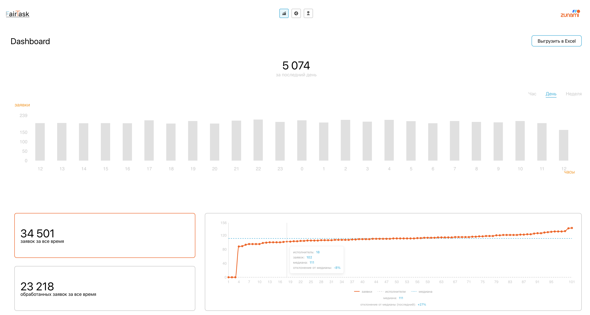
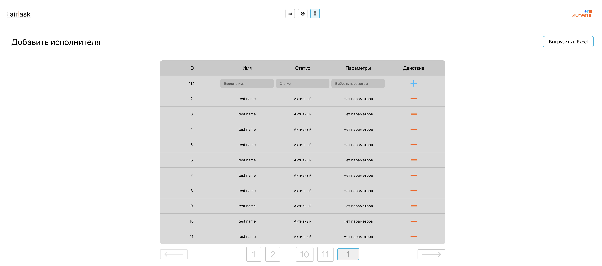
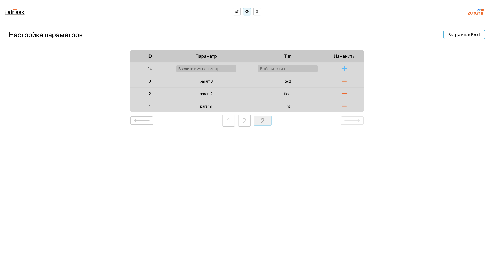

# Executor balancer

> **MPIT 2025 - FairTask Engine** - Умная система балансировки и управления задачами между исполнителями.

---

## 📄 Техническое задание

[Открыть техническое задание (PDF)](src/assets/kejs.pdf)

---

## 🖼️ Скриншоты интерфейса

- **Дашборд**
  
  

- **Страница добавления исполнителей**
  
  

- **Настройка параметров**
  
  

---

## 🚀 Quick Start

### Prerequisites

- **Node.js** (v18 or higher recommended)
- **npm** or **yarn**

### Installation

1. Clone the repository:
```bash
git clone <repository-url>
cd fair-task-proj
```

2. Install dependencies:
```bash
npm install
```

### Development

Start the development server:
```bash
npm run dev
```

The application will be available at `http://localhost:5173`

### Build

Create a production build:
```bash
npm run build
```

## 🏗️ Project Structure

This project follows the **Feature-Sliced Design (FSD)** architecture:

```
src/
├── app/           # Application initialization
├── pages/         # Page components (Auth, Dashboard)
├── widgets/       # Large UI blocks
├── features/      # Business functionality (Auth forms)
├── entities/      # Business entities
└── shared/        # Shared code
    ├── ui/        # UI components (Header, AnimatedButton)
    ├── hooks/     # Custom hooks
    ├── providers/ # Context providers
    └── contexts/  # React contexts
```

## 🛠️ Tech Stack

- **React 19** - UI library
- **TypeScript** - Type safety
- **Vite** - Build tool and dev server
- **Styled Components** - CSS-in-JS styling
- **React Router** - Navigation
- **ESLint** - Code linting
- **Prettier** - Code formatting

